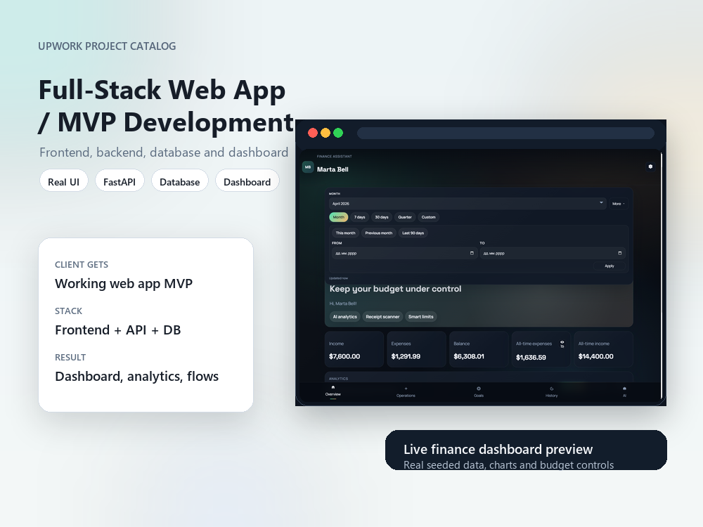
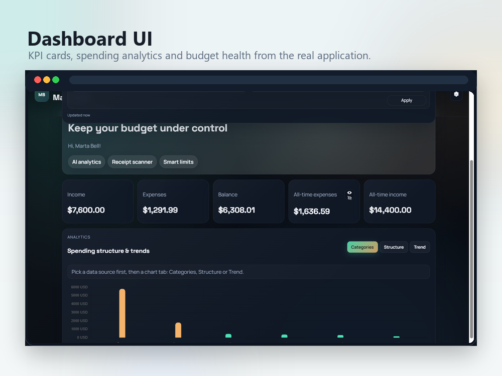
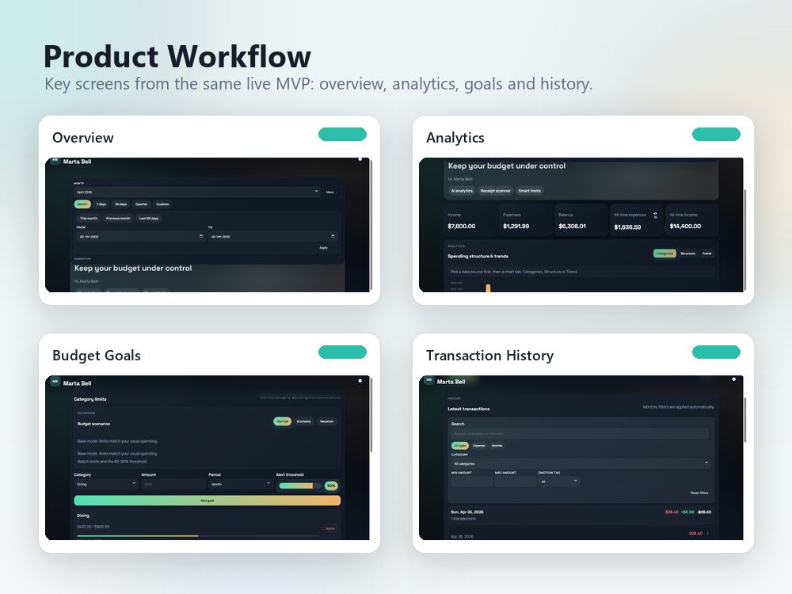
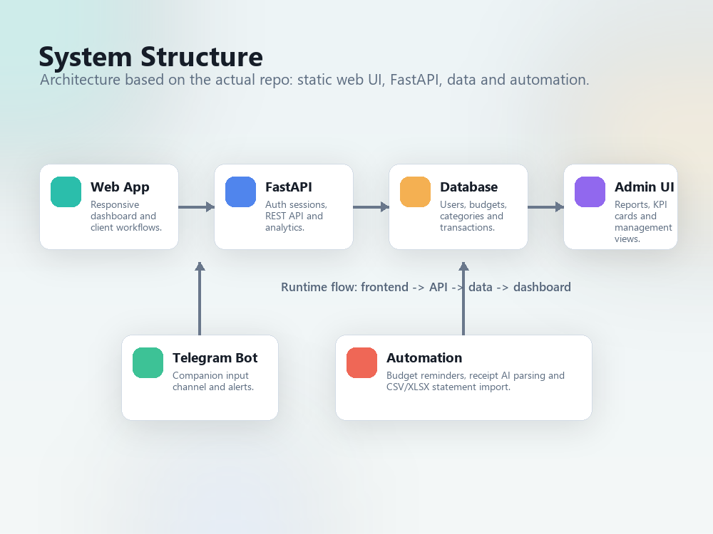
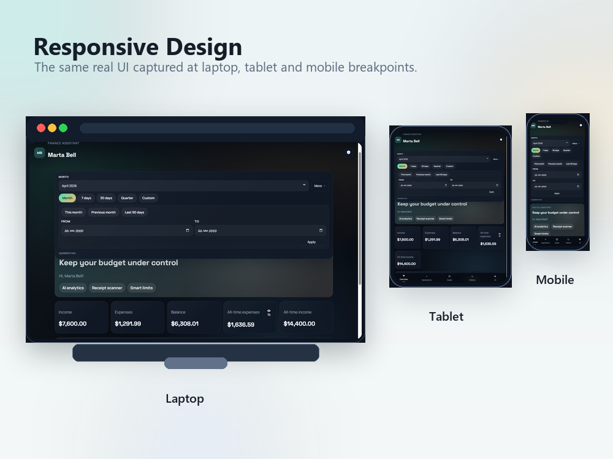

# Finance Assistant Bot

<p align="center">
  
</p>

<p align="center">
  
  
  
  
</p>

Finance Assistant Bot is a full-stack finance manager for Telegram. It combines a Telegram bot, FastAPI backend, SQLAlchemy/Alembic persistence, budget automation, CSV/XLSX import/export, and a responsive Telegram WebApp dashboard for analytics, goals, transaction history, and AI-assisted insights.

## Screenshots

<table>
  <tr>
    <td width="50%">
      
    </td>
    <td width="50%">
      
    </td>
  </tr>
  <tr>
    <td align="center"><strong>Dashboard analytics</strong></td>
    <td align="center"><strong>Core product flow</strong></td>
  </tr>
  <tr>
    <td width="50%">
      
    </td>
    <td width="50%">
      
    </td>
  </tr>
  <tr>
    <td align="center"><strong>System structure</strong></td>
    <td align="center"><strong>Responsive WebApp</strong></td>
  </tr>
</table>

## Features

- Telegram bot onboarding with `/start`, currency preferences, inline menus, quick category selection, and transaction parsing.
- FastAPI REST API for analytics, budgets, exports, Telegram webhook processing, and WebApp data.
- Responsive Telegram WebApp with KPI cards, charts, category budgets, savings goals, transaction filters, calendar history, and settings.
- SQLAlchemy models with Alembic migrations; local SQLite support and Docker-ready PostgreSQL setup.
- Optional Redis/APScheduler reminders for budget monitoring and recurring checks.
- CSV/XLSX statement import, CSV export, receipt extraction service, and optional OpenAI-powered assistant features.
- Production-oriented project shape: Dockerfile, docker-compose, healthcheck, logging, environment-based configuration, and tests.

## Tech Stack

| Layer | Tools |
| --- | --- |
| Bot | `python-telegram-bot`, Telegram Webhooks, Telegram WebApp |
| API | FastAPI, Pydantic, Uvicorn |
| Data | SQLAlchemy async, Alembic, SQLite/PostgreSQL |
| Automation | APScheduler, optional Redis |
| WebApp | HTML, CSS, vanilla JavaScript, Chart.js |
| AI / Import | OpenAI SDK, Pandas, OpenPyXL |
| DevOps | Docker, docker-compose, Loguru, optional Sentry |
| Tests | Pytest, pytest-asyncio |

## Project Structure

```text
manager-bot/
|-- app/
|   |-- api/          # FastAPI app, routes, dependencies
|   |-- core/         # settings and logging
|   |-- db/           # async database session/base
|   |-- models/       # SQLAlchemy models
|   |-- schemas/      # Pydantic schemas
|   |-- services/     # business logic, imports, reports, AI helpers
|   |-- tasks/        # scheduled reminders
|   |-- telegram/     # bot handlers and keyboards
|   `-- utils/        # parsing, dates, categories, web session helpers
|-- migrations/       # Alembic migrations
|-- tests/            # parser/date tests
|-- webapp/           # Telegram WebApp frontend
|-- project-catalog-images/
|   `-- *.png         # README/project preview screenshots
|-- docker-compose.yml
|-- Dockerfile
|-- pyproject.toml
`-- README.md
```

## Quick Start

Create environment settings:

```bash
cp .env.example .env
```

Fill the required values in `.env`:

```env
TELEGRAM_BOT_TOKEN=your-telegram-bot-token
TELEGRAM_WEBHOOK_SECRET=your-webhook-secret
ADMIN_API_KEY=your-admin-api-key
OPENAI_API_KEY=your-openai-api-key
```

Run the full stack with Docker:

```bash
docker compose up --build
```

Open the API:

```text
http://localhost:8000
```

Healthcheck:

```text
GET /health/ping
```

## Local Development

```bash
python -m venv .venv
.\.venv\Scripts\activate
pip install -e .[dev]
alembic upgrade head
uvicorn app.api.main:app --reload
```

Run tests:

```bash
pytest
```

## API Overview

| Endpoint | Description |
| --- | --- |
| `POST /telegram/webhook/{secret}` | Receives Telegram updates and forwards them to bot handlers. |
| `GET /health/ping` | Lightweight healthcheck endpoint. |
| `GET /api/v1/analytics/summary/{telegram_id}` | Monthly income, expense, balance, and category summary. |
| `GET /api/v1/analytics/kpi/{telegram_id}` | KPI dashboard data, protected by `X-API-Key`. |
| `GET /api/v1/analytics/export/{telegram_id}?days=30` | CSV export for a selected period. |
| `GET /api/v1/budgets/{telegram_id}` | User budget limits and progress. |
| `POST /api/v1/budgets/{telegram_id}` | Creates a budget limit for a category. |

## Telegram Webhook With Ngrok

For local Telegram webhook testing, fill `NGROK_AUTHTOKEN` in `.env` and keep `WEBHOOK_BASE_URL` empty. The Docker setup starts ngrok, reads the public tunnel URL from `http://localhost:4040/api/tunnels`, and registers:

```text
https://<ngrok-domain>/telegram/webhook/<secret>
```

Start the services:

```bash
docker compose up --build api db redis ngrok
```

## Notes For Portfolio Review

- The screenshots in `project-catalog-images/` are generated from the real local WebApp with seeded demo finance data.
- Runtime data, secrets, local databases, logs, virtual environments, caches, and raw screenshot captures are excluded from git.
- The project can be presented as a Telegram finance bot, a FastAPI backend project, or a full-stack MVP with dashboard and automation.
