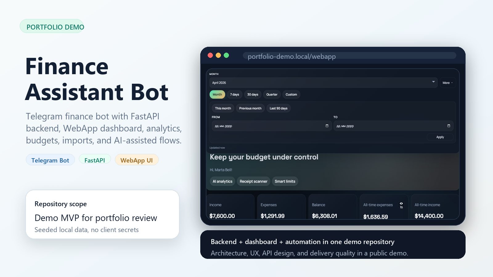
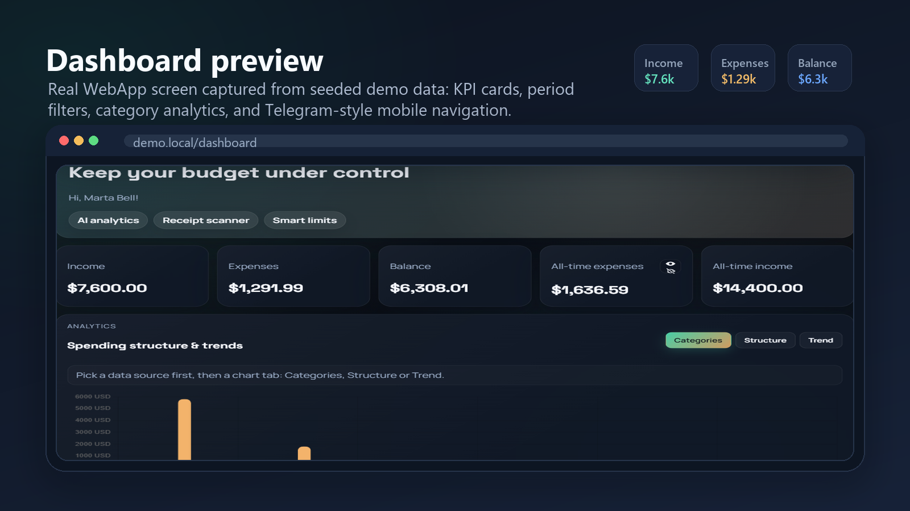
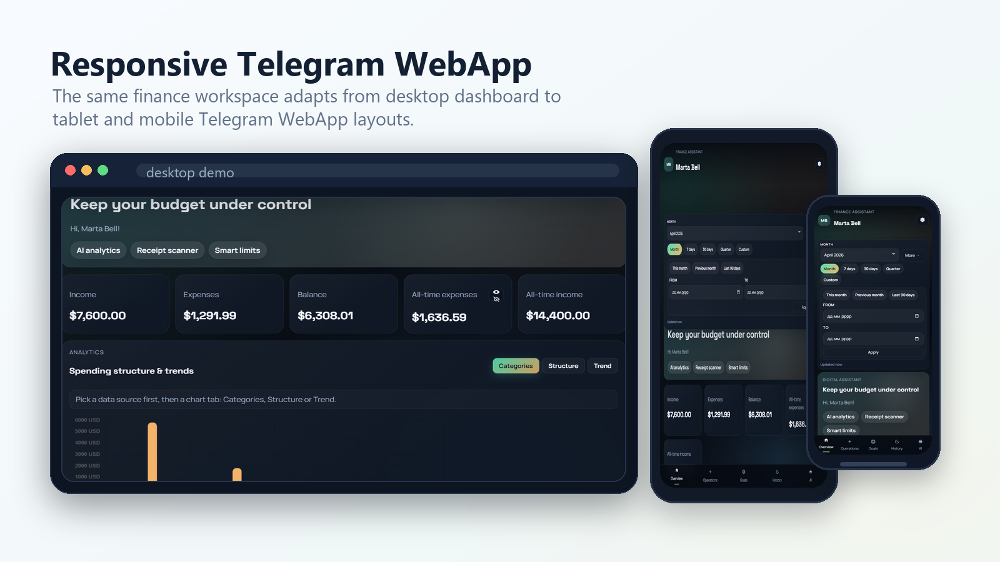
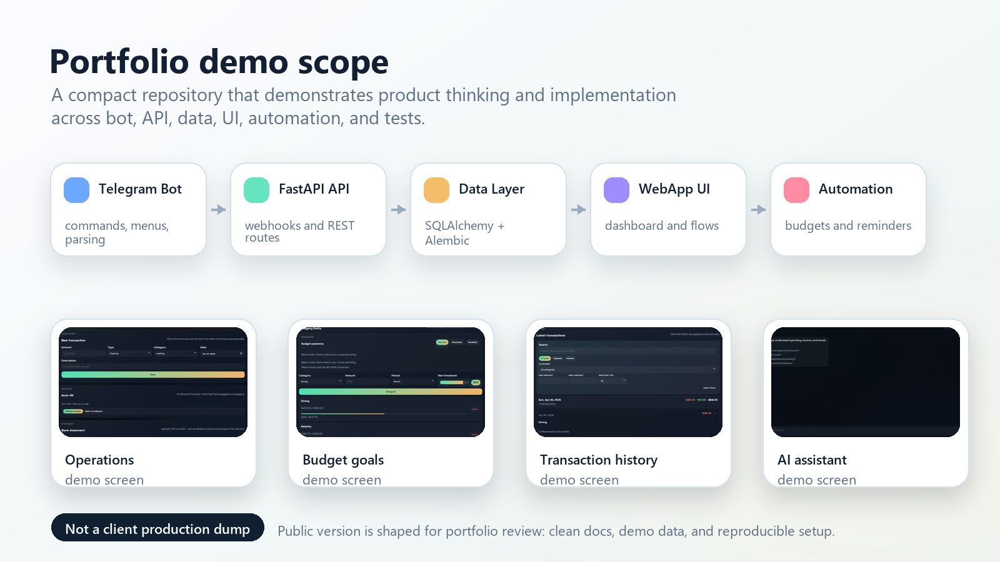

# Finance Assistant Bot

<p align="center">
  
</p>

<p align="center">
  <strong>Public portfolio/demo repository</strong> for a Telegram finance assistant with a FastAPI backend and responsive WebApp dashboard.
</p>

<p align="center">
  
  
  
  
  
  
</p>

## Release Positioning

`manager-bot` is intentionally published as a portfolio/demo release, not as a hosted SaaS and not as a dump of private client code.

This repository is designed to show:

- Telegram bot flow design.
- FastAPI backend structure and service boundaries.
- Async SQLAlchemy models plus Alembic migrations.
- A responsive Telegram WebApp dashboard.
- Demo-safe delivery practices: Docker, tests, CI, release notes, and repository hygiene.

## Screenshots

<p align="center">
  
</p>

<p align="center">
  
</p>

<p align="center">
  
</p>

## Feature Map

| Area | Demo capability |
| --- | --- |
| Bot | `/start`, quick actions, transaction parsing, reports, exports, mini app entry points |
| API | Healthcheck, Telegram webhook, analytics, budgets, WebApp endpoints |
| WebApp | KPI cards, charts, filters, quick transaction entry, assistant, settings |
| Data | Transactions, categories, budgets, user preferences, assistant feedback |
| Automation | Budget reminder service structure |
| AI-ready services | Receipt parsing and assistant wrappers with optional OpenAI configuration |

## Stack

| Layer | Tools |
| --- | --- |
| Bot | `python-telegram-bot`, Telegram Webhooks, Telegram WebApp |
| API | FastAPI, Pydantic, Uvicorn |
| Data | SQLAlchemy async, Alembic, SQLite, PostgreSQL-ready settings |
| Automation | APScheduler, optional Redis |
| WebApp | HTML, CSS, vanilla JavaScript, Chart.js |
| AI / Import | OpenAI SDK, Pandas, OpenPyXL |
| DevOps | Docker, Docker Compose, Loguru, optional Sentry |
| Validation | Pytest, Ruff, GitHub Actions |

## Repository Layout

```text
manager-bot/
|-- app/               # FastAPI app, services, models, bot logic
|-- migrations/        # Alembic migrations
|-- tests/             # Local validation and smoke coverage
|-- webapp/            # Telegram WebApp frontend
|-- docs/images/       # README and social preview assets
|-- .github/workflows/ # CI validation
|-- Dockerfile
|-- docker-compose.yml
|-- pyproject.toml
`-- README.md
```

## Quick Start

### 1. Create a local environment file

PowerShell:

```powershell
Copy-Item .env.example .env
```

Important:

- `.env.example` must stay placeholder-only.
- Never commit `.env`.
- Never paste real tokens or secrets into issues, PRs, screenshots, CI logs, or release notes.

### 2. Run locally with Python

```powershell
python -m venv .venv
.\.venv\Scripts\Activate.ps1
python -m pip install -e .[dev]
alembic upgrade head
python -m uvicorn app.api.main:app --reload
```

Local URLs:

```text
API:         http://localhost:8000
Healthcheck: http://localhost:8000/health/ping
WebApp:      http://localhost:8000/webapp/
```

### 3. Run with Docker Compose

```powershell
docker compose up --build
```

Notes:

- Docker Compose overrides a few container-only values internally, so `.env.example` can stay friendly for direct local runs.
- If `NGROK_AUTHTOKEN` is empty, the `ngrok` service stays idle and the app falls back to local polling behavior.

## Local Validation

Run the release checks from the project environment:

```powershell
ruff check .
pytest
python -c "from app.api.main import app; print(app.title)"
python -m pip wheel . --no-deps
docker build -t manager-bot-local-check .
```

## API Overview

| Endpoint | Description |
| --- | --- |
| `POST /telegram/webhook/{secret}` | Receives Telegram updates and forwards them to bot handlers. |
| `GET /health/ping` | Lightweight healthcheck endpoint. |
| `GET /api/v1/analytics/summary/{telegram_id}` | Monthly income, expense, balance, and category summary. |
| `GET /api/v1/analytics/kpi/{telegram_id}` | KPI dashboard data, protected by `X-API-Key`. |
| `GET /api/v1/analytics/export/{telegram_id}?days=30` | CSV export for a selected period. |
| `GET /api/v1/budgets/{telegram_id}` | User budget limits and progress. |
| `POST /api/v1/budgets/{telegram_id}` | Creates a budget limit for a category. |

## Demo Boundaries

Included:

- Source code for the bot, API, services, WebApp, migrations, tests, and CI.
- Placeholder configuration in `.env.example`.
- Local/Docker setup for demo and portfolio review.
- README visuals generated from demo-safe screenshots.

Not included:

- Real bot tokens, API keys, deployment secrets, production data, or customer credentials.
- Hosted production infrastructure.
- Client-specific business rules that do not belong in a public portfolio repository.
- PyPI package publishing for this release.

## Non-Goals

- This repository is not positioned as a turnkey production finance platform.
- No public hosted demo URL is promised in `v0.1.0`.
- The release does not try to clear all style/type-annotation debt; CI intentionally enforces release-safe Ruff checks only.

## Suggested GitHub Metadata

Repository description:

```text
Telegram finance assistant demo with FastAPI backend, Telegram WebApp dashboard, analytics, budgets, and Docker-ready local setup.
```

Topics:

```text
portfolio, demo-project, telegram-bot, fastapi, finance-dashboard, webapp, sqlalchemy, docker
```

Social preview:

```text
docs/images/readme-hero.png
```

## Release

The first public portfolio release is `v0.1.0`.

- Tag from `main` after CI is green.
- Use `CHANGELOG.md` as the release notes source.
- Do not publish to PyPI.
- Do not attach real data exports, secrets, or local artifacts to the GitHub release.
